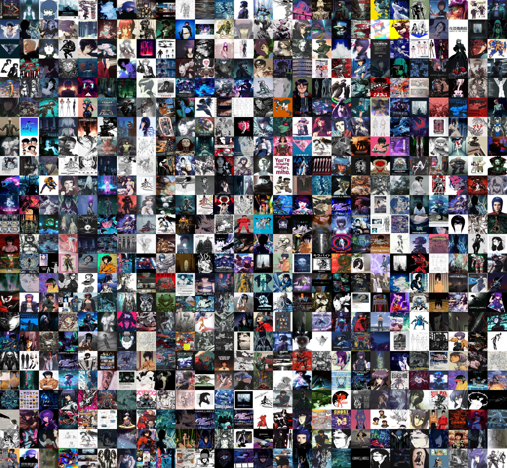

# pindownloader
Selenium-based scraper to download Pinterest pins (images and videos) by keywords, [demo here](https://x.com/azuk4r/status/1973855895949111733)
### Arguments
| Argument | Description |
|----------|-------------|
| `keywords` | Keywords to download content (can use "keywords.txt" with a list) |
| `--proxy PROXY` | Proxy URL |
| `--debug` | Enable debug mode |
| `-h, --help` | Show help message and exit |
### Notes
- Sometimes it downloads more or less content depending on the connection quality
- Currently the tool has no support for proxies with authentication for selenium (it will only use them for requests)
- The stealth covers almost all leaks except WebGL fingerprinting
### PoW
###### 624 Ghost in the Shell pinterest pins collage

### Credits
This tool relies on [selenium](https://github.com/SeleniumHQ/selenium), [webdriver-manager](https://github.com/SergeyPirogov/webdriver_manager), [requests](https://github.com/psf/requests) and [FFmpeg](https://github.com/FFmpeg/FFmpeg) (via [ffmpeg-python](https://github.com/kkroening/ffmpeg-python)) — thanks to all their developers!
### Disclaimer
This is a tool for educational / personal use only — the author is not responsible for any misuse

Shield: [![CC BY-NC-SA 4.0][cc-by-nc-sa-shield]][cc-by-nc-sa]

This work is licensed under a
[Creative Commons Attribution-NonCommercial-ShareAlike 4.0 International License][cc-by-nc-sa].

[![CC BY-NC-SA 4.0][cc-by-nc-sa-image]][cc-by-nc-sa]

[cc-by-nc-sa]: http://creativecommons.org/licenses/by-nc-sa/4.0/
[cc-by-nc-sa-image]: https://licensebuttons.net/l/by-nc-sa/4.0/88x31.png
[cc-by-nc-sa-shield]: https://img.shields.io/badge/License-CC%20BY--NC--SA%204.0-lightgrey.svg
